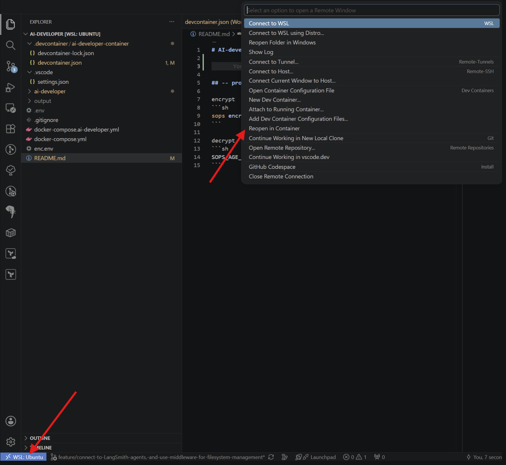

# AI-Developer

- decrypt env variables

```sh
SOPS_AGE_KEY_FILE=../key.txt sops decrypt enc.env > .env
```
- open dev container



- run ollama servers

```sh
docker compose up ollama -d
docker compose up ollama-init -d
```

- go inside the dev container and follow `README.md` file

## -- protect the env variables
encrypt
```sh
sops encrypt --age PUBLIC_KEY .env > enc.env
```

