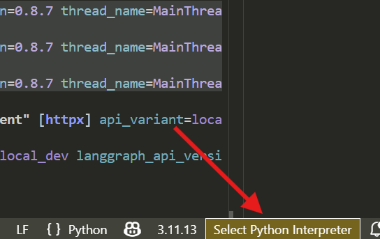

# How to use

- check path of poetry executable (apply this command only when you are on the same directory as `pyproject.toml`)

```sh
poetry env info
```

- asociate this executable project with Python interpreter



- debug agent

```sh
poetry run langgraph dev
```

# dev

- format code

```sh
poetry run black . --exclude deepagents
```


