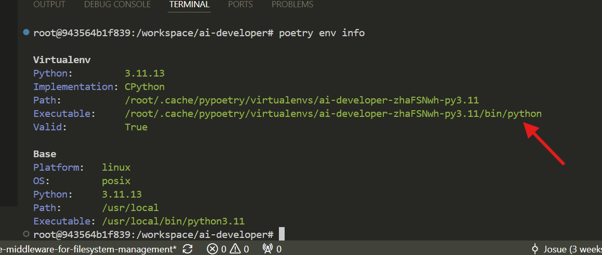
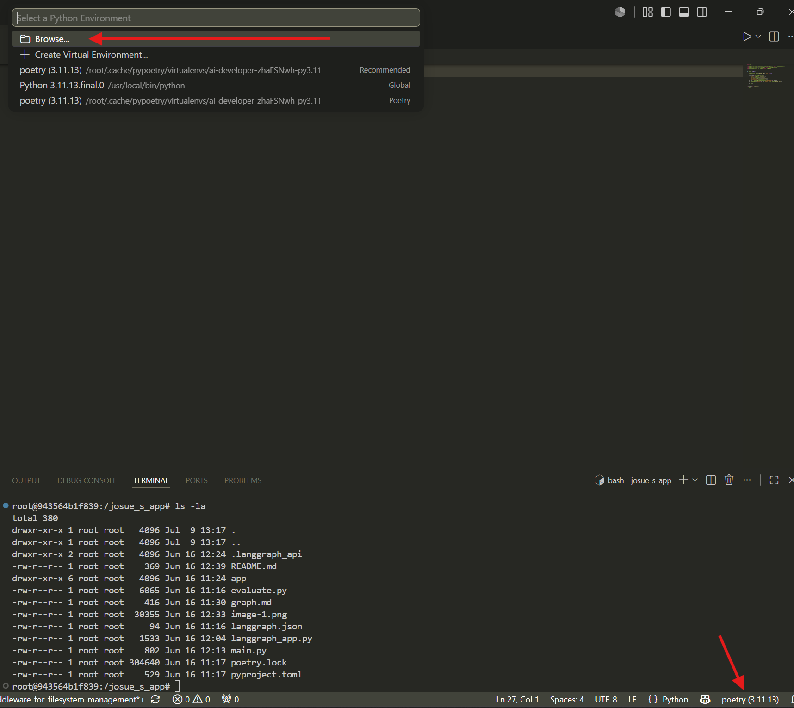

# how to use

- install the libraries manually. This is because this is a dev container and is not supposed to run independently (at least so far). 

```sh
poetry install
# use this when you are on production mode:
# poetry install --without dev
```

- check the path of the poetry executable

```sh
poetry env info
```


- Select any python file to see the "Select Python Interpreter" option. Then, asociate the executable with the project's Python interpreter:



- reoopen de container to apply the changes. This will help up get access to libraries used in this project. Now you can debug the agent:

```sh
poetry run langgraph dev
```

# dev

- format code

```sh
poetry run black . --exclude deepagents
```


Create a backend service for a health check application. Things like temperature, pulse-per-minute, blood preasure, summary-health, etc, should be reflected on the endpoints. Save all the files with the FileSystem tool.
