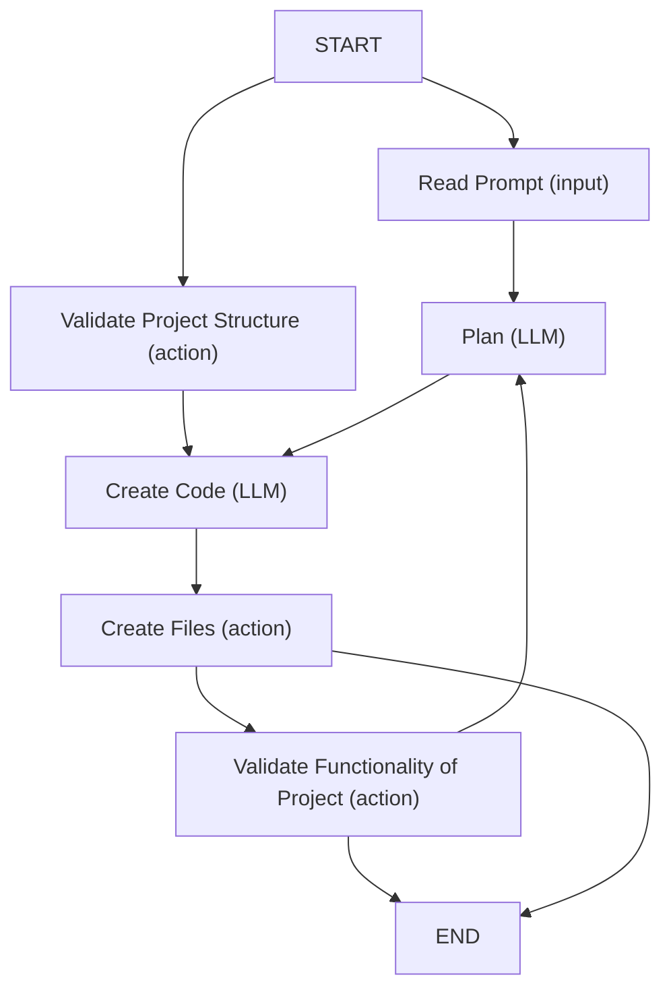

```mermaid
flowchart TD
    read-prompt["Read Prompt (input)"]
    plan["Plan (LLM)"]
    validate["Validate Project Structure (action)"]
    action["Create Files (action)"]
    evaluate["Validate Functionality of Project (action)"]
    code["Create Code (LLM)"]
    START --> validate --> code
    START --> read-prompt --> plan --> code --> action --> evaluate --> plan
    evaluate --> END
    action --> END

```